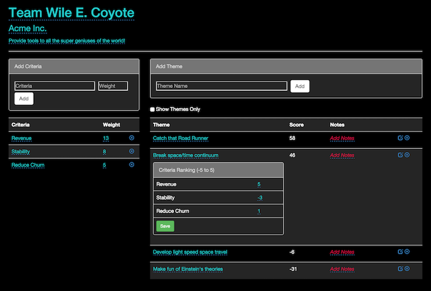

# Theme Scoring

[Mike Cohn](https://www.mountaingoatsoftware.com), author of [Agile Estimating and Planning](https://www.mountaingoatsoftware.com/books/agile-estimating-and-planning), introduced the [Theme Scoring approach to prioritizing Product Backlogs](https://www.mountaingoatsoftware.com/blog/new-tools-for-prioritizing-backlogs-available). As a Product Owner and former Certified Scrum Trainer who used to teach the Theme Scoring approach, I built a tool that I use and thought could be useful for others applying this approach to thier prioritization efforts.

## Build

Run `grunt` for building

## Run Application

In order to provide some access control, the Theme Scoring application uses basic authentication. To set the basic authentication credentials for your environment, you must create two environment variables with your own username and password values:

```
$ export TS_USERNAME=<username>
$ export TS_PASSWORD=<password>
```

Once these environment variables are set, run `npm start` for preview at http://localhost:9000. After adding criteria and themes the application should look something like the following:



This will save your data in the local storage on your browser. This means that the data you put in will only be available in the browser you run the application in.

To persist the data in a database, it is currently configured to accept credentials for [Orchestrate](https://orchestrate.io) when the following environment variables are set in your environment:

```
$ export ORCHESTRATE_API_KEY=<key>
$ export ORCHESTRATE_API_HOST=api.orchestrate.io
```

## Testing

Running `grunt test` will run the unit tests with karma.
